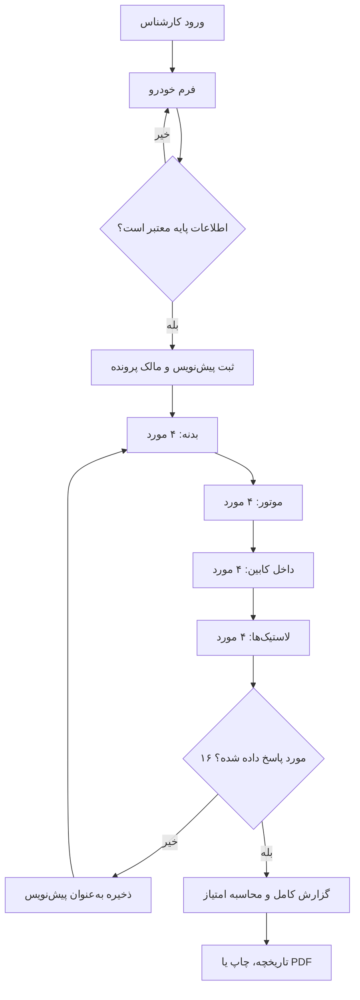
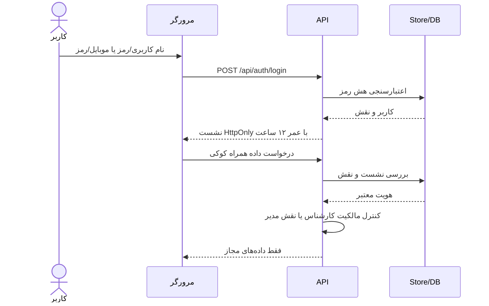
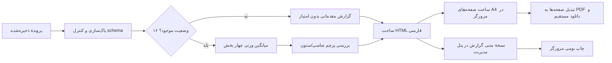
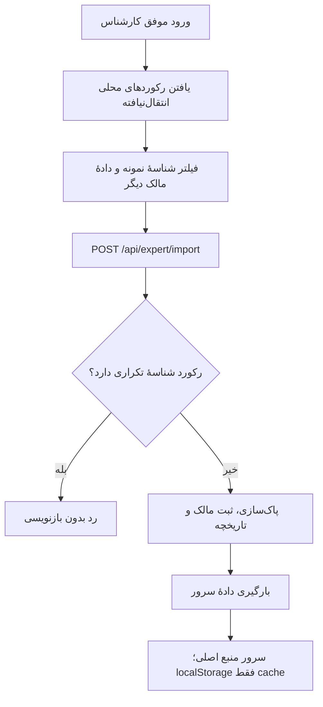

# جریان‌ها و نمودارهای فنی

## چرخهٔ ثبت کارشناسی

```mermaid
flowchart TD
  A[ورود کارشناس] --> B[فرم خودرو]
  B --> C{اطلاعات پایه معتبر است؟}
  C -- خیر --> B
  C -- بله --> D[ثبت پیش‌نویس و مالک پرونده]
  D --> E[بدنه: ۴ مورد]
  E --> F[موتور: ۴ مورد]
  F --> G[داخل کابین: ۴ مورد]
  G --> H[لاستیک‌ها: ۴ مورد]
  H --> I{۱۶ مورد پاسخ داده شده؟}
  I -- خیر --> J[ذخیره به‌عنوان پیش‌نویس]
  J --> E
  I -- بله --> K[گزارش کامل و محاسبه امتیاز]
  K --> L[تاریخچه، چاپ یا PDF]
```

## احراز هویت و کنترل مجوز

```mermaid
sequenceDiagram
  actor U as کاربر
  participant B as مرورگر
  participant A as API
  participant D as Store/DB
  U->>B: نام کاربری/رمز یا موبایل/رمز
  B->>A: POST /api/auth/login
  A->>D: اعتبارسنجی هش رمز
  D-->>A: کاربر و نقش
  A-->>B: نشست HttpOnly با عمر ۱۲ ساعت
  B->>A: درخواست داده همراه کوکی
  A->>D: بررسی نشست و نقش
  D-->>A: هویت معتبر
  A->>A: کنترل مالکیت کارشناس یا نقش مدیر
  A-->>B: فقط داده‌های مجاز
```

## انتشار گزارش

```mermaid
flowchart LR
  A[پروندهٔ ذخیره‌شده] --> B[پاک‌سازی و کنترل schema]
  B --> C{۱۶ وضعیت موجود؟}
  C -- نه --> D[گزارش مقدماتی بدون امتیاز]
  C -- بله --> E[میانگین وزنی چهار بخش]
  E --> F[بررسی پرچم شاسی/ستون]
  D --> G[ساخت HTML فارسی]
  F --> G
  G --> H[ساخت صفحه‌های A4 در مرورگر]
  H --> I[تبدیل صفحه‌ها به PDF و دانلود مستقیم]
  G --> J[نسخهٔ متنی گزارش در پنل مدیریت]
  J --> K[چاپ بومی مرورگر]
```

## انتقال از مرورگر قدیمی

```mermaid
flowchart TD
  A[ورود موفق کارشناس] --> B[یافتن رکوردهای محلی انتقال‌نیافته]
  B --> C[فیلتر شناسهٔ نمونه و دادهٔ مالک دیگر]
  C --> D[POST /api/expert/import]
  D --> E{رکورد شناسهٔ تکراری دارد؟}
  E -- بله --> F[رد بدون بازنویسی]
  E -- خیر --> G[پاک‌سازی، ثبت مالک و تاریخچه]
  G --> H[بارگیری دادهٔ سرور]
  H --> I[سرور منبع اصلی؛ localStorage فقط cache]
```
