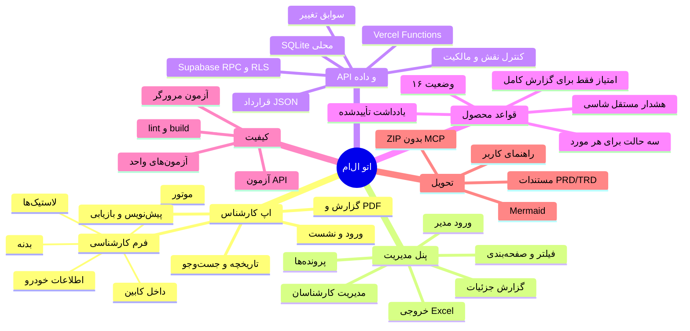

# نقشهٔ ذهنی پروژه

```mermaid
mindmap
  root((اتو ال‌ام))
    اپ کارشناس
      ورود و نشست
      فرم کارشناسی
        اطلاعات خودرو
        بدنه
        موتور
        داخل کابین
        لاستیک‌ها
      پیش‌نویس و بازیابی
      تاریخچه و جست‌وجو
      گزارش و PDF
    پنل مدیریت
      ورود مدیر
      مدیریت کارشناسان
      پرونده‌ها
      فیلتر و صفحه‌بندی
      گزارش جزئیات
      خروجی Excel
    API و داده
      قرارداد JSON
      کنترل نقش و مالکیت
      SQLite محلی
      Vercel Functions
      Supabase RPC و RLS
      سوابق تغییر
    قواعد محصول
      ۱۶ وضعیت
      سه حالت برای هر مورد
      امتیاز فقط برای گزارش کامل
      هشدار مستقل شاسی
      یادداشت تأییدشده
    کیفیت
      آزمون‌های واحد
      آزمون API
      آزمون مرورگر
      lint و build
    تحویل
      مستندات PRD/TRD
      راهنمای کاربر
      Mermaid
      ZIP بدون MCP
```
